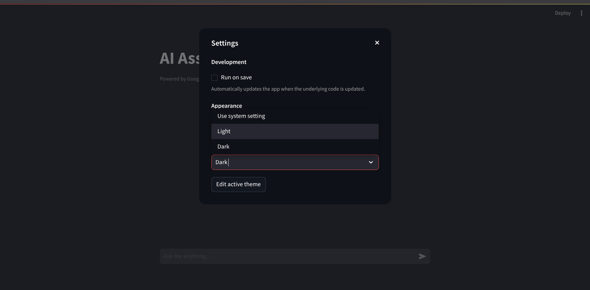
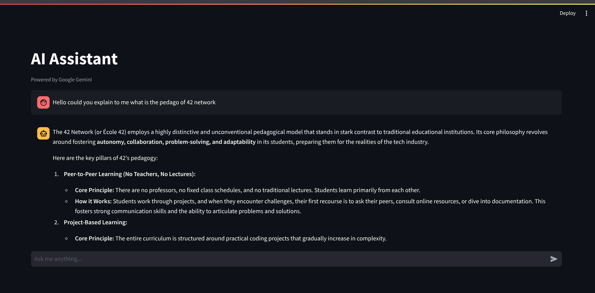
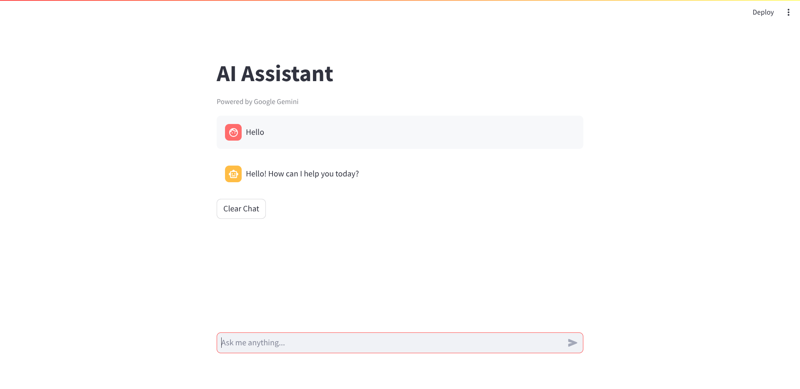

# Inception

A comprehensive containerized infrastructure project that deploys a complete web application stack using Docker. This project implements WordPress with MariaDB backend, Nginx reverse proxy, Redis caching, and additional services including FTP server, database management interface, IRC server, and an AI assistant powered by Google Gemini.

## Table of Contents

- [Overview](#overview)
- [Architecture](#architecture)
- [Services](#services)
- [Prerequisites](#prerequisites)
- [Installation](#installation)
- [Configuration](#configuration)
- [Usage](#usage)
- [Project Structure](#project-structure)
- [Docker Best Practices](#docker-best-practices)
- [AI Assistant](#ai-assistant)
- [Security Considerations](#security-considerations)
- [Troubleshooting](#troubleshooting)
- [License](#license)

## Overview

This project demonstrates advanced Docker containerization techniques and orchestration using Docker Compose. It builds a production-ready web infrastructure from scratch, adhering to best practices for security, performance, and maintainability.

### Key Features

- Custom Docker images built from official base images
- Multi-stage Dockerfiles for optimized image sizes
- Service orchestration with health checks and dependencies
- Persistent data storage with Docker volumes
- Secure HTTPS configuration with self-signed certificates
- Environment-based configuration management
- Microservices architecture with isolated containers

## Architecture

The infrastructure consists of multiple interconnected services communicating through a Docker bridge network:

```
┌─────────────────────────────────────────────────────────────┐
│                         Docker Host                          │
│                                                              │
│  ┌──────────┐     ┌───────────┐     ┌──────────┐          │
│  │  Nginx   │────▶│ WordPress │────▶│ MariaDB  │          │
│  │  :443    │     │   :9000   │     │  :3306   │          │
│  └──────────┘     └───────────┘     └──────────┘          │
│       │                 │                                   │
│       │                 ▼                                   │
│       │          ┌──────────┐                              │
│       │          │  Redis   │                              │
│       │          │  :1234   │                              │
│       │          └──────────┘                              │
│       │                                                     │
│  ┌────▼─────┐   ┌──────────┐   ┌──────────┐              │
│  │ Adminer  │   │   FTP    │   │   IRC    │              │
│  │  :9090   │   │ :20-21   │   │  :1337   │              │
│  └──────────┘   └──────────┘   └──────────┘              │
│                                                             │
│  ┌──────────────────────────────────────────┐             │
│  │          AI Assistant                     │             │
│  │            :8080                          │             │
│  └──────────────────────────────────────────┘             │
│                                                             │
│  Network: inception (bridge)                               │
└─────────────────────────────────────────────────────────────┘
```

### Service Dependencies

The services start in the following order based on health check conditions:

1. MariaDB and Redis start first
2. WordPress starts after MariaDB and Redis are healthy
3. Nginx starts after WordPress is healthy
4. Adminer starts after MariaDB is healthy
5. FTP, IRC, and AI Assistant start independently

## Services

### Core Services

#### Nginx (Port 443)
- Acts as a reverse proxy and web server
- Handles HTTPS connections with TLS 1.2/1.3
- Serves WordPress application via PHP-FPM
- Self-signed SSL certificates for secure connections

#### WordPress (Internal Port 9000)
- Content management system
- PHP 7.4 with PHP-FPM
- WP-CLI for automated setup and management
- Redis object caching integration
- Automated installation and configuration

#### MariaDB (Internal Port 3306)
- Relational database backend
- Persistent data storage with Docker volumes
- Automated database and user creation
- Health checks for service readiness

#### Redis (Internal Port 1234)
- In-memory data structure store
- Object caching for WordPress
- Improves application performance
- Custom port configuration

### Bonus Services

#### Adminer (Port 9090)
- Web-based database management interface
- Lightweight alternative to phpMyAdmin
- Direct access to MariaDB administration
- Single PHP file deployment

#### FTP Server (Ports 20-21, 50120-50130)
- vsftpd implementation
- Provides file transfer access to WordPress directory
- Passive mode support with configurable port range
- User isolation and security features

#### IRC Server (Port 1337)
- Custom IRC protocol implementation
- Real-time communication service
- Built from source with C++

#### AI Assistant (Port 8080)
- Streamlit-based web interface
- Google Gemini 2.5 Flash integration
- Natural language processing capabilities
- Multi-stage Docker build for minimal size
- Interactive chat interface

## Prerequisites

### System Requirements

- Linux or macOS operating system
- Docker Engine 20.x or higher
- Docker Compose 1.29 or higher
- Minimum 4GB RAM
- 10GB free disk space

### Software Dependencies

- Docker
- Docker Compose
- Make (GNU Make)
- Git

### Installation Commands

**Ubuntu/Debian:**
```bash
sudo apt update
sudo apt install docker.io docker-compose make git
sudo usermod -aG docker $USER
```

**Arch Linux:**
```bash
sudo pacman -S docker docker-compose make git
sudo systemctl enable --now docker
sudo usermod -aG docker $USER
```

**macOS:**
```bash
brew install docker docker-compose make git
```

## Installation

### 1. Clone the Repository

```bash
git clone https://github.com/callmemehdy/Inception.git
cd Inception
```

### 2. Configure Environment Variables

Copy the example environment file and edit it with your values:

```bash
cp srcs/.env.example srcs/.env
nano srcs/.env
```

Required configurations:
- Set your domain name
- Configure database credentials
- Set WordPress admin credentials
- Add Gemini API key for AI assistant

### 3. Update Volume Paths

Edit `srcs/docker-compose.yml` and update the volume device paths to match your system:

```yaml
volumes:
  mariadb:
    driver_opts:
      device: /path/to/your/data/mariadb  # Update this
  wordpress:
    driver_opts:
      device: /path/to/your/data/wordpress  # Update this
```

### 4. Build and Deploy

```bash
make up
```

This command will:
- Create necessary data directories
- Build all Docker images
- Start all containers in correct order
- Wait for health checks to pass

### 5. Access Services

After successful deployment:

- WordPress: `https://your-domain.42.fr` or `https://localhost`
- Adminer: `http://localhost:9090`
- AI Assistant: `http://localhost:8080`
- FTP: `ftp://localhost:21`
- IRC: Port `1337`

## Configuration

### Environment Variables

The `.env` file contains all configuration parameters:

#### Domain Configuration
```bash
DOMAIN_NAME=your-domain.42.fr
```

#### Database Configuration
```bash
MARIADB_DB=wordpress_db
MARIADB_USER=wp_user
MARIADB_PASSWORD=strong_password
MARIADB_ROOT_PASS=root_password
```

#### WordPress Configuration
```bash
ADMIN_USER=admin
ADMIN_PASS=admin_password
ADMIN_EMAIL=admin@example.com
WEBSITE_TITLE=My WordPress Site

WP_USER=editor_user
WP_USER_PASS=user_password
WP_USER_ROLE=author
WP_USER_EMAIL=user@example.com
```

#### Redis Configuration
```bash
REDIS_HOST=redis
REDIS_PORT=1234
```

#### Service Credentials
```bash
FTP_PASS=ftp_password
IRC_PORT=1337
IRC_PASS=irc_password
```

#### AI Assistant Configuration
```bash
GEMINI_API_KEY=your_gemini_api_key_here
```

Get your Gemini API key from: https://makersuite.google.com/app/apikey

### SSL Certificates

The Nginx service automatically generates self-signed SSL certificates during build:

- Certificate: `/etc/nginx/tls/selfsignedcert.crt`
- Private Key: `/etc/nginx/tls/pkey.key`

For production, replace these with valid certificates from a Certificate Authority.

## Usage

### Makefile Commands

The project includes a Makefile with convenient commands:

```bash
make up              # Build and start all containers
make down            # Stop and remove all containers
make show            # Display running containers
make exec            # Execute command in container
                     # Usage: make exec <container> <command>
make remove_volumes  # Clear all volume data
make prune           # Remove all unused Docker resources
```

### Container Management

**Start services:**
```bash
make up
```

**Stop services:**
```bash
make down
```

**View logs:**
```bash
docker logs -f <container_name>
```

**Restart a service:**
```bash
docker compose -f srcs/docker-compose.yml restart <service_name>
```

**Access container shell:**
```bash
make exec <container_name> /bin/bash
```

## Project Structure

```
.
├── Makefile                          # Build and deployment commands
├── README.md                         # Project documentation
├── pics/                            # Screenshots and images
│   ├── light_mode.png
│   ├── prompt_testing.png
│   ├── setting_1.png
│   └── setting_2.png
└── srcs/
    ├── .env                         # Environment variables (not in repo)
    ├── .env.example                 # Environment template
    ├── docker-compose.yml           # Service orchestration
    └── requirements/
        ├── nginx/
        │   ├── Dockerfile           # Nginx image definition
        │   └── conf/
        │       └── def.conf         # Nginx configuration
        ├── mariadb/
        │   ├── Dockerfile           # MariaDB image definition
        │   └── tools/
        │       └── mariadbing.sh    # Database initialization
        ├── wordpress/
        │   ├── Dockerfile           # WordPress image definition
        │   └── tools/
        │       └── wordpressing.sh  # WordPress setup script
        └── bonus/
            ├── redis/
            │   └── Dockerfile
            ├── adminer/
            │   └── Dockerfile
            ├── ftp_server/
            │   ├── Dockerfile
            │   ├── conf/
            │   │   └── vsftpd.conf
            │   └── tools/
            │       └── ftping.sh
            ├── extra_service/       # IRC Server
            │   ├── Dockerfile
            │   └── tools/
            └── static_wpage/        # AI Assistant
                ├── Dockerfile
                └── tools/
                    ├── app.py
                    ├── requirements.txt
                    └── README.md
```

## Docker Best Practices

This project implements several Docker best practices:

### Image Optimization

1. **Multi-stage Builds**: The AI Assistant uses multi-stage builds to separate build dependencies from runtime, resulting in smaller final images.

2. **Layer Caching**: Commands are ordered to maximize Docker layer caching effectiveness.

3. **Minimal Base Images**: Using slim variants (`python:3.11-slim`, `debian:bullseye`) reduces image size.

4. **Clean Build Artifacts**: Removing package manager caches and temporary files:
   ```dockerfile
   RUN apt-get update && apt-get install -y package && \
       apt-get clean && rm -rf /var/lib/apt/lists/*
   ```

### Security

1. **Non-root Users**: Services run with appropriate user permissions.

2. **Environment Variables**: Sensitive data stored in `.env` file, not hardcoded.

3. **Network Isolation**: Services communicate through isolated Docker network.

4. **Health Checks**: All critical services include health checks for reliability.

### Maintainability

1. **Single Responsibility**: Each container runs one primary service.

2. **Declarative Configuration**: Using docker-compose.yml for infrastructure as code.

3. **Version Pinning**: Specific versions for base images and dependencies.

4. **Documentation**: Inline comments and external documentation.

## AI Assistant

The AI Assistant is a modern web application that provides natural language interaction through Google's Gemini AI model.

### Features

- Interactive chat interface with message history
- Real-time responses from Gemini 2.5 Flash
- Session state management
- Clean, responsive design
- Error handling and user feedback

### Architecture

Built with:
- **Frontend**: Streamlit (Python web framework)
- **Backend**: Google Generative AI SDK
- **Model**: Gemini 2.5 Flash
- **Container**: Multi-stage Docker build (~200MB)

### Usage Examples

The AI Assistant can help with various tasks:

#### Interface Overview



The application provides a clean interface with customizable settings for theme, layout, and interaction preferences.


Advanced configuration options allow fine-tuning of the AI response behavior.

#### Testing Capabilities



The assistant handles various types of queries, from simple questions to complex problem-solving tasks.

#### Theme Support



The interface supports both light and dark themes for comfortable viewing in different environments.

### Technical Implementation

The AI Assistant uses a multi-stage Dockerfile to optimize the final image size:

**Stage 1 - Builder:**
- Installs build dependencies (gcc)
- Compiles Python packages
- Creates wheel files

**Stage 2 - Runtime:**
- Copies only compiled packages
- No build tools included
- Minimal attack surface
- Faster startup time

**Result:** Final image is approximately 200MB compared to 1GB+ with full build tools.

### Configuration

The AI Assistant requires a Gemini API key in the environment:

```bash
GEMINI_API_KEY=your_api_key_here
```

The application validates the API key on startup and provides clear error messages if configuration is incorrect.

### Extending the AI Assistant

To modify the AI model or behavior:

1. Edit `srcs/requirements/bonus/static_wpage/tools/app.py`
2. Available models are listed in the Gemini API documentation
3. Common alternatives:
   - `models/gemini-2.5-flash` - Current (fast)
   - `models/gemini-2.5-pro` - More capable
   - `models/gemini-flash-latest` - Auto-updating

## Security Considerations

### Production Checklist

Before deploying to production:

- [ ] Replace self-signed certificates with valid SSL certificates
- [ ] Use strong, unique passwords for all services
- [ ] Restrict database access to WordPress container only
- [ ] Configure firewall rules to limit external access
- [ ] Enable Docker security features (AppArmor, SELinux)
- [ ] Implement regular backup strategy
- [ ] Update base images and dependencies regularly
- [ ] Monitor container logs for suspicious activity
- [ ] Use Docker secrets for sensitive data
- [ ] Implement rate limiting on public endpoints

### Environment Security

- Never commit `.env` file to version control
- Use `.env.example` as template without real credentials
- Set restrictive file permissions: `chmod 600 srcs/.env`
- Rotate passwords and API keys regularly
- Use separate credentials for development and production

### Network Security

- Nginx is the only service exposing HTTPS port externally
- Internal services communicate through private Docker network
- FTP server uses passive mode with restricted port range
- Database and Redis are not accessible from outside the network

## Troubleshooting

### Common Issues

**Port Already in Use:**
```bash
Error: Bind for 0.0.0.0:443 failed: port is already allocated
```
Solution: Stop services using the ports or change port mappings in docker-compose.yml

**Permission Denied on Volumes:**
```bash
Error: mkdir /data/wordpress: permission denied
```
Solution: Ensure volume directories exist and have correct permissions:
```bash
mkdir -p ../data/wordpress ../data/mariadb
chmod -R 755 ../data
```

**MariaDB Won't Start:**
Solution: Check logs and ensure volume isn't corrupted:
```bash
docker logs mariadb
make remove_volumes  # Warning: This deletes all data
make up
```

**WordPress Installation Loop:**
Solution: The WordPress container may need more time. Check if database is ready:
```bash
docker exec mariadb mysqladmin -u root -p$MARIADB_ROOT_PASS ping
```

**AI Assistant Model Error:**
Solution: Verify API key is correct and model name is valid:
```bash
# Check available models match your API key
docker exec ai_assistant python -c "import google.generativeai as genai; \
  genai.configure(api_key='YOUR_KEY'); \
  print([m.name for m in genai.list_models()])"
```

### Health Check Failures

View container health status:
```bash
docker ps --format "table {{.Names}}\t{{.Status}}"
```

Inspect specific health check:
```bash
docker inspect --format='{{json .State.Health}}' <container_name>
```

### Log Analysis

View real-time logs for all services:
```bash
docker compose -f srcs/docker-compose.yml logs -f
```

View logs for specific service:
```bash
docker logs -f <container_name>
```

Search logs for errors:
```bash
docker logs <container_name> 2>&1 | grep -i error
```

## License

This project is developed as part of the 42/1337 school curriculum. It is intended for educational purposes.

---

**Project Details:**
- School: 1337/42 Network
- Developed by: Mehdi El Akary
- Last Updated: January 2026

For issues, questions, or contributions, please refer to the project repository.
